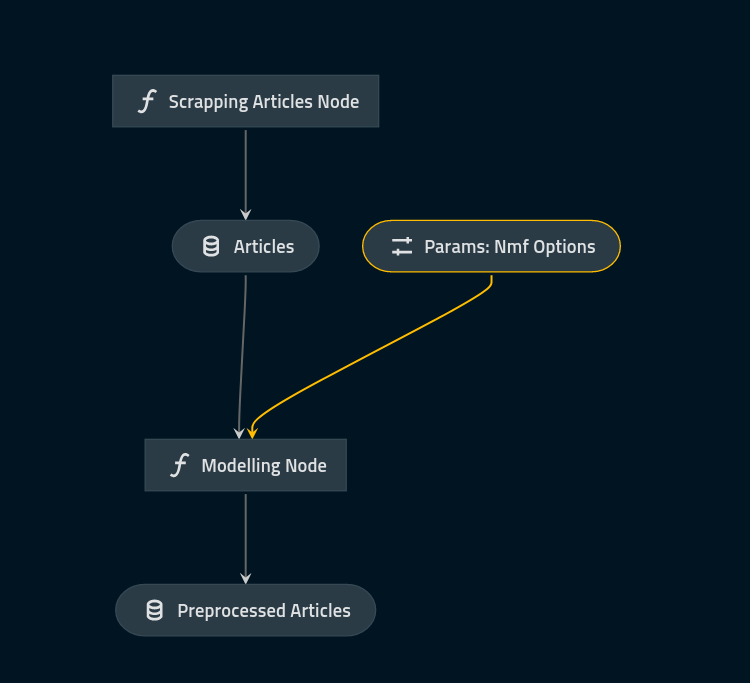

## Scrapper for https://bbc.com/news/world/ for newest articles

Notebook `main.ipynb` contains implementation of NMF model for topic modelling

Folder `topic_modelling_kedro` contains kedro project with implemeted pipelines for articles extraction and topic modelling

## In order to use it, 

1. clone this repo, install kedro `pip install kedro`
2. install dependencies located in topic_modelling_kedro/src/requirements.txt
3. run pipielines `kedro run` readme in topic_modelling_kedro specifies more options how to run different pipelines separately 

 

 
NMF model was selected because it is much faster than LDA, which also is used for topic modelling but approaches this problem differently
